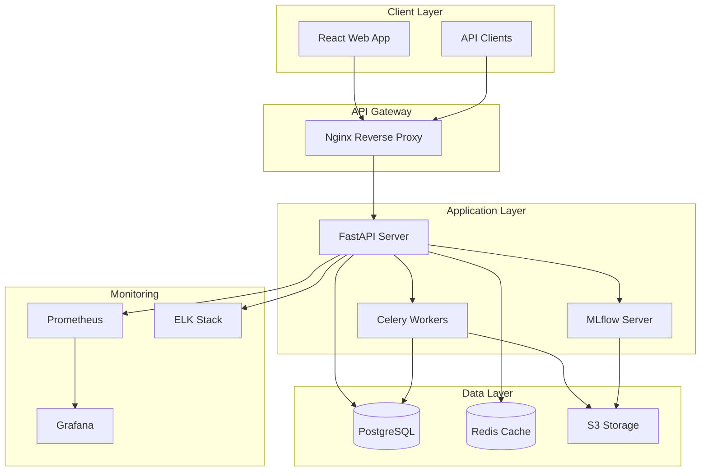

# Electric Vehicle Analysis Platform - Architecture Documentation

## Table of Contents
1. [System Overview](#system-overview)
2. [Architecture Principles](#architecture-principles)
3. [System Architecture](#system-architecture)
4. [Component Details](#component-details)
5. [Data Flow](#data-flow)
6. [Technology Stack](#technology-stack)
7. [Security Architecture](#security-architecture)
8. [Deployment Architecture](#deployment-architecture)
9. [Monitoring & Observability](#monitoring--observability)
10. [Scaling Strategy](#scaling-strategy)

## System Overview

The Electric Vehicle Analysis Platform is a production-ready machine learning system designed to analyze electric vehicle adoption patterns, provide predictive analytics, and deliver insights through a modern web interface.

### Key Features
- **Data Processing Pipeline**: Automated ingestion and processing of EV datasets
- **ML Model Training**: Support for multiple algorithms with hyperparameter tuning
- **Real-time Predictions**: REST API for single and batch predictions
- **Experiment Tracking**: MLflow integration for model versioning and comparison
- **Interactive Dashboard**: React-based UI for data visualization and model management
- **Production Deployment**: Kubernetes-ready with monitoring and scaling

## Architecture Principles

### 1. Microservices Architecture
- **Separation of Concerns**: Each service handles a specific domain
- **Independent Deployment**: Services can be updated without affecting others
- **Technology Agnostic**: Services can use different technologies as needed

### 2. Event-Driven Design
- **Asynchronous Processing**: Long-running tasks handled by background workers
- **Message Queuing**: Redis for task distribution and caching
- **Real-time Updates**: WebSocket connections for live updates

### 3. Data-Centric Approach
- **Single Source of Truth**: PostgreSQL as primary data store
- **Data Versioning**: Track dataset and model versions
- **Audit Trail**: Complete logging of all operations

### 4. Security First
- **JWT Authentication**: Stateless authentication with refresh tokens
- **Role-Based Access Control**: Fine-grained permissions
- **API Rate Limiting**: Prevent abuse and ensure fair usage

## System Architecture



## Component Details

### 1. Frontend (React + TypeScript)
```
frontend/
├── src/
│   ├── components/       # React components
│   │   ├── Dashboard.tsx
│   │   ├── ModelTraining.tsx
│   │   └── Predictions.tsx
│   ├── services/         # API integration
│   │   └── api.ts
│   ├── hooks/           # Custom React hooks
│   ├── utils/           # Utility functions
│   └── App.tsx          # Main application
```

**Key Technologies**:
- React 18 with TypeScript
- Ant Design for UI components
- Chart.js for data visualization
- Axios for API communication

### 2. Backend API (FastAPI)
```
app/
├── api/
│   ├── v1/
│   │   └── endpoints/   # API endpoints
│   └── deps.py          # Dependencies
├── core/
│   ├── config.py        # Configuration
│   └── security.py      # Security utilities
├── database/
│   ├── models.py        # SQLAlchemy models
│   └── session.py       # Database sessions
├── services/
│   ├── data_service.py  # Data processing
│   └── model_service.py # ML operations
└── main.py              # Application entry
```

**Key Features**:
- Async request handling
- Automatic API documentation
- Request validation with Pydantic
- JWT authentication
- Database connection pooling

### 3. Machine Learning Pipeline
```
ml_pipeline/
├── training/
│   ├── train.py         # Training orchestration
│   ├── evaluate.py      # Model evaluation
│   └── optimize.py      # Hyperparameter tuning
├── inference/
│   ├── predict.py       # Prediction service
│   └── batch.py         # Batch processing
└── models/
    ├── sklearn_models.py
    └── deep_models.py
```

**Supported Algorithms**:
- Random Forest
- Gradient Boosting
- XGBoost
- Neural Networks
- Linear/Logistic Regression
- K-Means Clustering

### 4. Data Storage

#### PostgreSQL Schema
- **datasets**: Uploaded dataset metadata
- **models**: Trained model information
- **predictions**: Prediction history
- **experiments**: Experiment tracking
- **users**: User management
- **jobs**: Background job tracking

#### Redis Usage
- Session management
- API rate limiting
- Result caching
- Task queue
- Real-time metrics

### 5. MLflow Integration
- Experiment tracking
- Model versioning
- Artifact storage
- Model registry
- Performance comparison

## Data Flow

### 1. Data Ingestion Flow
```
CSV/Excel Upload → Validation → Processing → Storage → Analysis
```

### 2. Model Training Flow
```
Dataset Selection → Feature Engineering → Training → Evaluation → Registration
```

### 3. Prediction Flow
```
Request → Validation → Model Loading → Inference → Response
```

## Technology Stack

### Core Technologies
| Component | Technology | Version |
|-----------|------------|---------|
| Frontend | React | 18.x |
| Backend | FastAPI | 0.104.x |
| Database | PostgreSQL | 15.x |
| Cache | Redis | 7.x |
| ML Framework | Scikit-learn | 1.3.x |
| Experiment Tracking | MLflow | 2.8.x |
| Container | Docker | 24.x |
| Orchestration | Kubernetes | 1.28.x |

### Development Tools
- **Version Control**: Git + GitHub
- **CI/CD**: GitHub Actions
- **Code Quality**: Black, isort, flake8, mypy
- **Testing**: pytest, Jest
- **Documentation**: Sphinx, Swagger

## Security Architecture

### Authentication & Authorization
```python
# JWT Token Structure
{
  "sub": "user_id",
  "exp": "expiration_time",
  "iat": "issued_at",
  "type": "access|refresh"
}
```

### Security Measures
1. **Password Security**:
   - Bcrypt hashing
   - Minimum complexity requirements
   - Password reset tokens

2. **API Security**:
   - Rate limiting per user/IP
   - API key authentication
   - CORS configuration

3. **Data Security**:
   - Encrypted connections (TLS)
   - Database encryption at rest
   - Sensitive data masking

## Deployment Architecture

### Docker Compose (Development)
```yaml
services:
  backend:
    image: ev-analysis-backend
    ports: ["8000:8000"]
    
  frontend:
    image: ev-analysis-frontend
    ports: ["3000:80"]
    
  postgres:
    image: postgres:15
    
  redis:
    image: redis:7-alpine
    
  mlflow:
    image: mlflow-server
    ports: ["5000:5000"]
```

### Kubernetes (Production)
```yaml
apiVersion: apps/v1
kind: Deployment
metadata:
  name: ev-analysis
spec:
  replicas: 3
  selector:
    matchLabels:
      app: ev-analysis
  template:
    spec:
      containers:
      - name: backend
        image: ev-analysis:latest
        resources:
          requests:
            memory: "512Mi"
            cpu: "500m"
          limits:
            memory: "1Gi"
            cpu: "1000m"
```

### Scaling Strategy
1. **Horizontal Pod Autoscaling**:
   - Scale based on CPU/memory usage
   - Min: 2 pods, Max: 10 pods

2. **Database Scaling**:
   - Read replicas for queries
   - Connection pooling
   - Query optimization

3. **Caching Strategy**:
   - Redis for hot data
   - CDN for static assets
   - Browser caching

## Monitoring & Observability

### Metrics Collection
```python
# Prometheus metrics
http_requests_total
http_request_duration_seconds
model_training_duration_seconds
prediction_latency_seconds
active_models_count
```

### Logging Strategy
- **Application Logs**: Structured JSON logging
- **Access Logs**: Nginx access logs
- **Error Tracking**: Sentry integration
- **Audit Logs**: Database operations

### Alerting Rules
1. **High Error Rate**: > 1% 5xx errors
2. **Slow Response**: p95 latency > 1s
3. **Low Disk Space**: < 20% available
4. **High Memory Usage**: > 80% utilized

## Performance Optimization

### API Optimization
- Response compression
- Query optimization
- Connection pooling
- Async processing

### ML Optimization
- Model caching
- Batch prediction
- GPU acceleration
- Feature preprocessing

### Database Optimization
- Indexing strategy
- Query optimization
- Materialized views
- Partitioning

## Disaster Recovery

### Backup Strategy
- **Database**: Daily automated backups
- **Models**: Version control in MLflow
- **Code**: Git repository
- **Configurations**: Kubernetes ConfigMaps

### Recovery Procedures
1. **Database Recovery**: Restore from latest backup
2. **Service Recovery**: Kubernetes auto-restart
3. **Model Recovery**: Load from MLflow registry
4. **Data Recovery**: Replay from event log

## Future Enhancements

### Planned Features
1. **AutoML Integration**: Automated model selection
2. **Real-time Streaming**: Apache Kafka integration
3. **Advanced Visualizations**: D3.js dashboards
4. **Multi-tenancy**: Organization-level isolation
5. **GraphQL API**: Alternative API interface

### Technical Debt
- Migrate to async database operations
- Implement circuit breakers
- Add distributed tracing
- Enhance test coverage

## Conclusion

This architecture provides a scalable, maintainable, and production-ready platform for electric vehicle analysis. The modular design allows for easy extensions and modifications while maintaining system stability and performance.